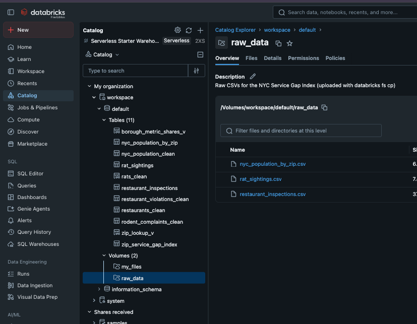
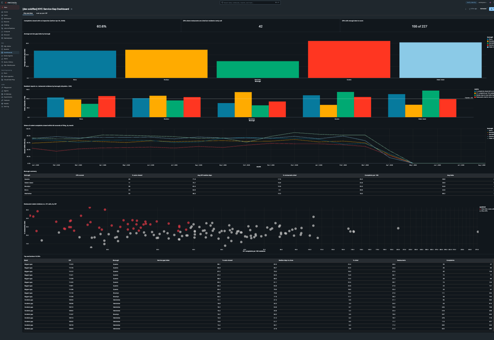
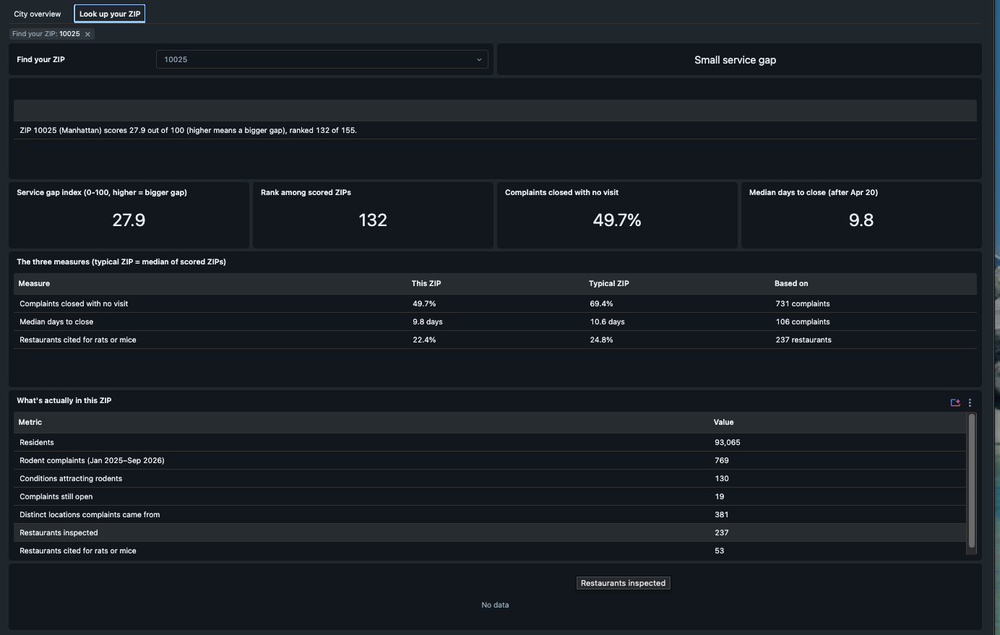
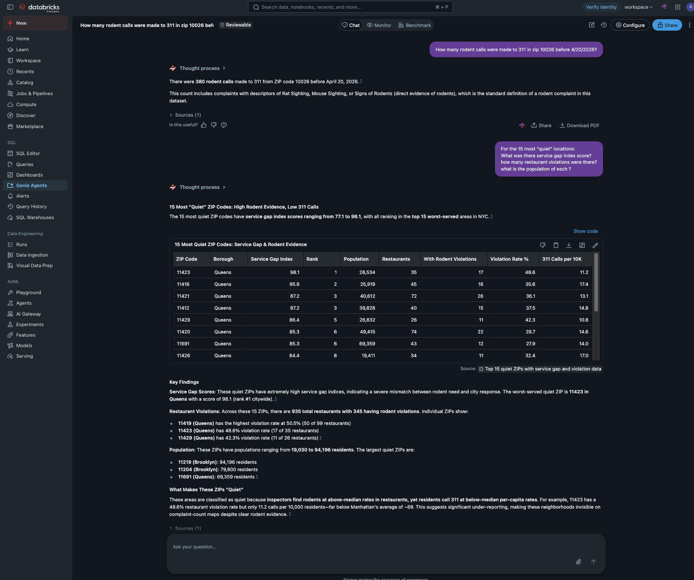

# NYC Service Gap Index — Databricks Asset Bundle

One team's solution to the **"Is My Block Cursed?"** challenge from the AI Hackathon + Networking NYC, packaged so that anyone with a free Databricks account can recreate it. You copy this repo to your computer, run a few terminal commands, and the tables, notebooks, dashboard, and Genie space are live in your own workspace. No manual data upload and no clicking around notebooks is needed.

**Time to set up:** about 20–30 minutes the first time. It runs on [Databricks Free Edition](https://www.databricks.com/learn/free-edition), so no paid account is needed.

---

## About this project


Built over three days at the **AI Hackathon + Networking NYC** (September 18–20, 2026, Dining Hall at Queens College), hosted by Databricks, the Tech Incubator at Queens College, and WAGMI-Connect.

**Team:** Will M. and Dylan T.

**The challenge.** Every team got two public datasets, 311 rodent complaints and restaurant health inspections, and one question: when a New Yorker calls for help, does the city show up? The deliverable was a Service Gap Index for every NYC ZIP code plus a dashboard where anyone can look up their own block. The full participant guide is in [docs/hackathon-brief.md](docs/hackathon-brief.md), and the original handout and raw data files are in [`hackathon-materials/`](hackathon-materials/).

**A third dataset we added.** The two hackathon files let you count complaints per ZIP, but a raw count mostly measures how many people live there. To make sense of rodent phone calls *relative to population*, the team pulled in a third file, `nyc_population_by_zip.csv` (Census/ACS population estimates with margins of error, 231 ZIPs), and committed it in [`resources/data/`](resources/data/). It feeds the per-10,000-resident columns and the "quiet ZIP" flag (ZIPs where inspectors find rodents but residents rarely call). It was not part of the challenge materials, which is why it lives with the bundle's data rather than in `hackathon-materials/`.

### Please read this before judging the code

* **This is one team's solution, and it is imperfect.** It is what two people produced in three days, not a reference implementation. Some analytical choices are debatable and some code is rough. The [key decisions notebook](resources/notebooks/key_decisions_notebook.sql) documents the choices we made and why.
* **Nobody on the team had used Databricks before**, or any similar platform. Everything here was learned during the event. If you spot a better way to do something, you are probably right.
* **Why this repo exists.** Many hackathon teams built their solution inside one teammate's Databricks account. If you were on such a team, you may have no copy of what you built. This repo lets you stand up a mostly working version of one solution in your own free account in about half an hour, so you have something concrete to explore, take apart, and compare against your own approach.
* **An invitation.** We all spent three days exploring the same data. If your team shares its solution on GitHub too, everyone gets to learn from more than one attempt. Feel free to fork this, borrow the bundle setup, and replace the analysis with your own.

---

## Before you start: a few terms

If you've never set up a Databricks project before, these are the only concepts you need:

| Term | What it means here |
| --- | --- |
| **Workspace** | Your Databricks account's website. Its address looks like `https://dbc-a1b2c3d4-e5f6.cloud.databricks.com` (AWS), `https://adb-1234567890123456.7.azuredatabricks.net` (Azure), or `https://1234567890123456.7.gcp.databricks.com` (GCP). Copy it from your browser's address bar after logging in, keeping only the part up to the domain. |
| **Databricks CLI** | A small program you install on your computer. It lets you push files to your workspace from a terminal instead of uploading them by hand. |
| **Profile** | A saved login for the CLI. You give it a name (this guide uses `target`) and it remembers which workspace to talk to and how to authenticate. |
| **Asset bundle** | This repo. The file `databricks.yml` is a packing list that tells the CLI what to send to your workspace and where. |
| **Bundle target** | An environment defined in `databricks.yml`. This repo defines `dev` and `prod`. You will use `dev`. This is **not** the same thing as the profile named `target`; the name overlap is unfortunate. |
| **Job** | A saved, runnable task in Databricks. This bundle defines one job, `build_tables`, that loads the CSVs and builds every table. You'll trigger it from the terminal. |
| **SQL warehouse** | The compute that runs the dashboard's queries. The dashboard needs to know which one to use, so you'll copy its ID. |
| **Catalog / schema** | Where tables live, written as `catalog.schema.table`. Everything here uses `workspace.default`. |

---

## Quick start

### Prerequisites

* A Databricks workspace. [Databricks Free Edition](https://www.databricks.com/learn/free-edition) works: it includes serverless compute, a SQL warehouse, and Unity Catalog, which is everything this project needs. Sign up takes a couple of minutes.
* Git installed on your computer.
* A terminal (Terminal on macOS, PowerShell on Windows).

### Step 1 — Install the Databricks CLI

Pick the command for your operating system and run it in a terminal.

**macOS (Homebrew):**

```bash
brew tap databricks/tap
brew install databricks
```

**Windows (PowerShell):**

```powershell
winget install Databricks.DatabricksCLI
```

**Linux, or macOS without Homebrew:**

```bash
curl -fsSL https://raw.githubusercontent.com/databricks/setup-cli/main/install.sh | sh
```

Confirm it worked. You should see a version number:

```bash
databricks --version
```

> **Do not** use `pip install databricks-cli` or `pip install databricks-sdk`. Those install different, older tools that will not work with this guide.

### Step 2 — Log the CLI in to your workspace

You'll create a profile named `target`. Replace `<your-workspace-url>` with your workspace address from the terms table above. (If you already have a profile called `target` for a different workspace, pick another name and use it everywhere this guide says `target`.)

**Option A — Log in through your browser (recommended, no token needed):**

```bash
databricks auth login --host <your-workspace-url> --profile target
```

A browser window opens. Sign in to Databricks and approve the request. Come back to the terminal when it says login succeeded.

**Option B — Use a personal access token** (if Option A is blocked by your admin):

1. In Databricks, click your profile icon (top right) → **Settings** → **Developer** → **Access tokens** → **Manage** → **Generate new token**.
2. Give it a comment like `cli` and click **Generate**. Copy the token now; you can't see it again.
3. Run this and paste the token when prompted:

   ```bash
   databricks configure --profile target --host <your-workspace-url> --token
   ```

Either way, confirm the login works:

```bash
databricks current-user me --profile target
```

If you see your name and email in the output, you're authenticated.

### Step 3 — Copy this repo to your computer

```bash
git clone <this-repo-url> nyc-service-gap-index
cd nyc-service-gap-index
```

Run every remaining command from inside this folder.

### Step 4 — Find your SQL warehouse ID

The dashboard needs a SQL warehouse to run its queries. List the ones in your workspace:

```bash
databricks warehouses list --profile target
```

You'll see something like:

```
ID                Name                          Size      State
b46ccaa42cf433a9  Serverless Starter Warehouse  2X-Small  STOPPED
```

Copy the 16-character **ID** from the first column. Any warehouse works; a stopped one starts automatically when the dashboard needs it.

If the list is empty, create one in the Databricks UI: left sidebar → **SQL Warehouses** → **Create SQL warehouse** → accept the defaults → **Create**. Then rerun the list command.

### Step 5 — Deploy the bundle to your workspace

Tell the CLI which profile to use for the rest of this terminal session:

```bash
export DATABRICKS_CONFIG_PROFILE=target
```

(`target` here is the profile name you chose in Step 2. If you named it something else, use that name.)

Save your warehouse ID from Step 4 in a variable too, so you don't have to retype it:

```bash
export WAREHOUSE_ID=<your-warehouse-id>
```

Check the bundle for errors, then deploy it:

```bash
databricks bundle validate --target dev --var="warehouse_id=$WAREHOUSE_ID"
databricks bundle deploy   --target dev --var="warehouse_id=$WAREHOUSE_ID"
```

> `--target dev` selects the `dev` environment defined in `databricks.yml`. It has nothing to do with the profile named `target`.

Deploying takes about a minute. It creates the dashboard, the `build_tables` job, the three notebooks, and an empty Unity Catalog volume called `workspace.default.raw_data` for the data files. When it finishes you'll see something like this (the `Created` lines can appear in any order):

```
Created volumes.raw_data
Created jobs.build_tables
Created dashboards.zip_service_gap_index
Files: 6 uploaded, 0 deleted
Resources: 3 created, 0 changed, 0 deleted, 0 unchanged
```

Everything lands in a folder called `nyc_service_gap_index` in your workspace home (**Workspace → Home → nyc_service_gap_index**). Because `dev` is a development target, the dashboard and job names get a `[dev <your name>]` prefix. That's expected.

Now upload the three CSV files into the volume. This takes about 10 seconds:

```bash
databricks fs cp resources/data dbfs:/Volumes/workspace/default/raw_data --recursive --overwrite
```

You'll see one line per file. (Why a separate step? Data files belong in a volume, not in the workspace folder with the notebooks. Large files in the workspace folder fail to read on some accounts.)

### Step 6 — Build the tables

One command runs the whole pipeline on serverless compute and waits for it to finish:

```bash
databricks bundle run build_tables --target dev --var="warehouse_id=$WAREHOUSE_ID"
```

It prints a link to the run and then status lines. Expect about 4 minutes:

```
"[dev <your name>] NYC Service Gap Index - Build Tables" QUEUED
"[dev <your name>] NYC Service Gap Index - Build Tables" RUNNING
"[dev <your name>] NYC Service Gap Index - Build Tables" TERMINATED SUCCESS
```

The job has two steps:

1. **ingest** reads the three CSVs you uploaded to the volume and creates the raw tables. It also creates the `workspace` catalog and `default` schema if they don't exist.
2. **build** transforms those into five clean tables, the final `zip_service_gap_index` table, and two views the dashboard reads.

If the last line says `TERMINATED SUCCESS`, you're done with data. If it says `FAILED`, open the run link it printed; the failing step's error is shown there. See [Troubleshooting](#troubleshooting).

<details>
<summary>Prefer to run the notebooks by hand instead?</summary>

1. In Databricks, click **Workspace** in the left sidebar, then **Home**.
2. Open `nyc_service_gap_index` → `files` → `resources` → `notebooks`.
3. Open `ingest_raw_data`. At the top right, use the **Connect** dropdown to choose **Serverless**. Click **Run all**. (It reads from the volume you uploaded to in Step 5.)
4. When it finishes, open `build_notebook` and do the same.

The **Sanity checks** cell at the bottom of `build_notebook` shows `actual` vs `expected` counts. If every row matches, the build succeeded.

</details>

### Step 7 — Add the Genie space

The Genie space lets you ask questions about the data in plain English. It lives in its own small bundle in the `genie/` folder, because Databricks checks that every table it uses exists at the moment the space is created, and those tables only exist after Step 6. Deploy it now:

```bash
cd genie
databricks bundle deploy --target dev --var="warehouse_id=$WAREHOUSE_ID"
cd ..
```

You'll see `Created genie_spaces.nyc_rodent_insights`. Then click **Genie Agents** in the left sidebar and open **[dev <your name>] Genie Agent: NYC Rodent and Restaurant Health Insights**. Under **Configure → Examples** you'll find the 11 example questions with their SQL. Try asking one, such as "How is ZIP 11367 served?"

### Step 8 — Open the dashboard

Click **Dashboards** in the left sidebar and open **[dev <your name>] NYC Service Gap Dashboard**. Or, from the terminal:

```bash
databricks bundle open zip_service_gap_index --target dev --var="warehouse_id=$WAREHOUSE_ID"
```

The dashboard has two pages:

* **City overview**: three headline numbers, average service gap index by borough, resident reports vs. restaurant evidence, the monthly share of complaints auto-closed, a borough summary table, a scatter of 311 calls vs. restaurant citations, and the top and bottom 10 ZIPs.
* **Look up your ZIP**: pick a ZIP code to see its score, rank, the three component measures against a typical ZIP, raw counts, and any data caveats.

If the widgets are blank, click **Refresh** at the top of the dashboard. The SQL warehouse may take a minute to start.

---

## What you'll see when it's done

These screenshots come from a fresh Free Edition account after following the steps above, so this is what success looks like.

**Catalog.** Under **Catalog → workspace → default** you'll find the 3 raw tables, 5 clean tables, the index, 3 views, and the `raw_data` volume holding the CSVs.



**Dashboard, City overview page.** Headline numbers, the index by borough, resident reports vs. restaurant evidence, the collapse of auto-closing in April 2026, a borough summary, the scatter of 311 calls vs. citations, and the top and bottom 10 ZIPs.



**Dashboard, Look up your ZIP page.** Pick a ZIP to see its score and rank, its three measures against a typical ZIP, and the raw counts behind them.



**Genie space.** Ask questions in plain English. The space ships with 11 example questions and their SQL, plus 11 benchmark questions you can run from the **Benchmark** tab to check that answers stay accurate over time.



---

## Troubleshooting

| Problem | Fix |
| --- | --- |
| **`databricks: command not found`** | The CLI isn't installed or isn't on your PATH. Redo Step 1, then close and reopen your terminal. |
| **`Error: default auth: cannot configure default credentials`** | The CLI doesn't know which profile to use. Run `export DATABRICKS_CONFIG_PROFILE=target` (Step 5), or add `--profile target` to the command. |
| **"Credential was not sent" or "invalid header field value for Authorization"** (Option B) | The token has stray whitespace or line breaks, or wasn't saved. Rerun the `databricks configure` command from Step 2 and paste the token straight from the Databricks UI with nothing extra. Make sure `--token` is typed with two plain hyphens. |
| **`--profile "target" has host "..." which conflicts with --host "..."`** | A profile named `target` already exists on this computer and points at a different workspace. Either pick a new name (`--profile mylab`) and use that name in the `export DATABRICKS_CONFIG_PROFILE=` step, or delete the old `[target]` section from `~/.databrickscfg` and rerun the login. |
| **Login window never opens (Option A)** | Your admin may have disabled OAuth. Use Option B in Step 2. |
| **Deploy fails mentioning `warehouse_id`** | Pass `--var="warehouse_id=<id>"` on the deploy command. The default value in `databricks.yml` is the original author's warehouse and won't exist in your workspace. |
| **Can't find the notebooks** | Browse to **Workspace → Home → nyc_service_gap_index → files → resources → notebooks**. Or run `databricks bundle summary --target dev --var="warehouse_id=$WAREHOUSE_ID"` and use the path it prints. In the Workspace browser you can paste that path into the search box. |
| **Job fails in `ingest` with `Missing in /Volumes/workspace/default/raw_data`** | The CSVs haven't been uploaded yet. Run the `databricks fs cp` command from Step 5. |
| **Job fails in `ingest` with `FAILED_READ_FILE`, `Input/output error`, or a `403 Forbidden` from storage** | You're on an old version of this repo that read CSVs from the workspace folder. Run `git pull`, redeploy (Step 5), upload the CSVs with `databricks fs cp`, and rerun the job. |
| **Job fails immediately mentioning serverless or compute** | Your workspace doesn't have serverless jobs enabled. Ask an admin to enable it, or run the notebooks by hand on a cluster (see the expandable section in Step 6). |
| **"Catalog workspace does not exist"** or permission error creating it | You need `CREATE CATALOG` permission, or an admin can create the `workspace` catalog and `default` schema for you. See [Using a different catalog or schema](#using-a-different-catalog-or-schema). |
| **Dashboard shows no data** | The build job must finish first. The dashboard reads `workspace.default.zip_service_gap_index`, which doesn't exist until Step 6 succeeds. |
| **Notebooks are under a hidden `.bundle` folder** | You deployed with an old version of the repo. Run `git pull` and redeploy (Step 5); the files move to **Home → nyc_service_gap_index**. The old `.bundle/nyc_service_gap_index` folder can be deleted from the workspace browser. The dashboard gets a new URL. |
| **Genie deploy succeeded but the space isn't on the Genie Agents page** | You're on an old version of the repo that created the space inside the hidden `.bundle` folder. Run `git pull`, then redeploy the Genie bundle (Step 7). It moves into your home folder and appears in the list. |
| **Genie deploy fails with `Table 'workspace.default.…' does not exist`** | The build job hasn't run yet, or failed. Finish Step 6 first, then rerun the Genie deploy in Step 7. |
| **Notebook won't run / "no compute attached"** (manual route only) | Use the **Connect** dropdown at the top right of the notebook to pick Serverless or a running cluster. |

---

## What's included

| File | Description |
| --- | --- |
| `genie/databricks.yml` | A second, tiny bundle holding only the Genie space (see Step 7 for why it's separate) |
| `genie/nyc_rodent_insights.geniespace.json` | The Genie space export: data sources, instructions, 11 example questions with SQL, 11 benchmark questions |
| `docs/hackathon-brief.md` | The "Is My Block Cursed?" participant guide, converted to Markdown |
| `hackathon-materials/` | The original handout (Word) and the two raw CSVs exactly as provided at the event. Not used by the bundle; kept for reference. |
| `databricks.yml` | Bundle definition: the `warehouse_id` variable, `dev`/`prod` targets, the `raw_data` volume, the `build_tables` job, the dashboard, and which files to sync |
| `resources/data/rat_sightings.csv` | NYC 311 rodent complaint records (50,954 rows). Same rows as the hackathon file, with a few unused columns dropped. |
| `resources/data/restaurant_inspections.csv` | NYC DOHMH restaurant inspection records (158,083 rows). Same rows as the hackathon file, with a few unused columns dropped. |
| `resources/data/nyc_population_by_zip.csv` | ACS population estimates by ZIP code (231 rows). Not provided at the event; the team downloaded it to turn raw counts into per-capita rates. |
| `resources/notebooks/ingest_raw_data.py` | Reads the 3 CSVs from the `raw_data` volume and creates the raw tables |
| `resources/notebooks/build_notebook.sql` | SQL that transforms raw tables into clean tables, the final `zip_service_gap_index`, and the views the dashboard and Genie space use |
| `resources/notebooks/key_decisions_notebook.sql` | Documentation notebook: 11 analytical decisions with validation queries |
| `resources/dashboards/zip_service_gap_index_dashboard.json` | The NYC Service Gap Dashboard: two pages, 22 datasets, exported from the source workspace |

## Data pipeline overview

```
resources/data/*.csv
        │
        ▼  databricks fs cp  (you run this once after deploy)
  volume workspace.default.raw_data
        │
        ▼  build_tables job, step 1: ingest_raw_data
  3 raw tables in workspace.default
        │
        ▼  build_tables job, step 2: build_notebook
  5 clean tables + zip_service_gap_index + 3 views
        │
        ├──▶  Dashboard reads zip_service_gap_index, rat_sightings, and two views
        │
        └──▶  Genie space reads the clean tables, the index, and rats_clean
```

| Raw table (from CSV) | Clean table (build notebook creates) |
| --- | --- |
| `rat_sightings` | `rodent_complaints_clean` |
| `restaurant_inspections` | `restaurant_violations_clean` → `restaurants_clean` |
| `nyc_population_by_zip` | `nyc_population_clean` |
| | **`zip_service_gap_index`** (final output the dashboard reads) |
| | `zip_lookup_v`, `borough_metric_shares_v` (views on top of the index for the dashboard) |
| | `rats_clean` (typed view over raw complaints, used by the Genie space) |

---

## Using a different catalog or schema

The notebooks and dashboard hardcode `workspace.default`. If you can't use that name, you have two options:

1. **Create matching names** in your workspace (simplest; needs an admin if you lack permission):

   ```sql
   CREATE CATALOG IF NOT EXISTS workspace;
   CREATE SCHEMA IF NOT EXISTS workspace.default;
   ```

   Then no code changes are needed.

2. **Find-and-replace** `workspace.default` with your `catalog.schema` in these four files, then redeploy (Step 5):
   * `resources/notebooks/ingest_raw_data.py`
   * `resources/notebooks/build_notebook.sql`
   * `resources/notebooks/key_decisions_notebook.sql`
   * `resources/dashboards/zip_service_gap_index_dashboard.json`

## Redeploying after changes

If you edit any file in this repo, push the changes with the same deploy command from Step 5, then rerun the job from Step 6. You only need to repeat the `databricks fs cp` upload if the CSVs changed. If you edited the Genie space, rerun the deploy in Step 7.

To remove everything the bundles created from your workspace (the tables and the volume's files stay), run both destroys:

```bash
databricks bundle destroy --target dev --var="warehouse_id=$WAREHOUSE_ID"
cd genie && databricks bundle destroy --target dev --var="warehouse_id=$WAREHOUSE_ID" && cd ..
```

---

## Project background

The NYC Service Gap Index measures the gap between rodent need and city response for each ZIP code:

* **Component 1 — No-show rate:** % of pre-April-2026 311 rodent complaints auto-closed within 60 seconds (no inspection).
* **Component 2 — Slow response:** Median days to close complaints filed Apr–Jul 2026 (after auto-closing stopped).
* **Component 3 — Rodent need:** % of restaurants cited for rats (04K) or mice (04L) on inspection.

The composite index (0–100) averages the three percentile ranks. A higher score means a bigger gap between how many rodents inspectors find and how little the city responds.

For a detailed walkthrough of each analytical decision (what counts as a rodent complaint, why auto-closes are excluded, why median not average, and so on), open `key_decisions_notebook` in the workspace and run the cells.
